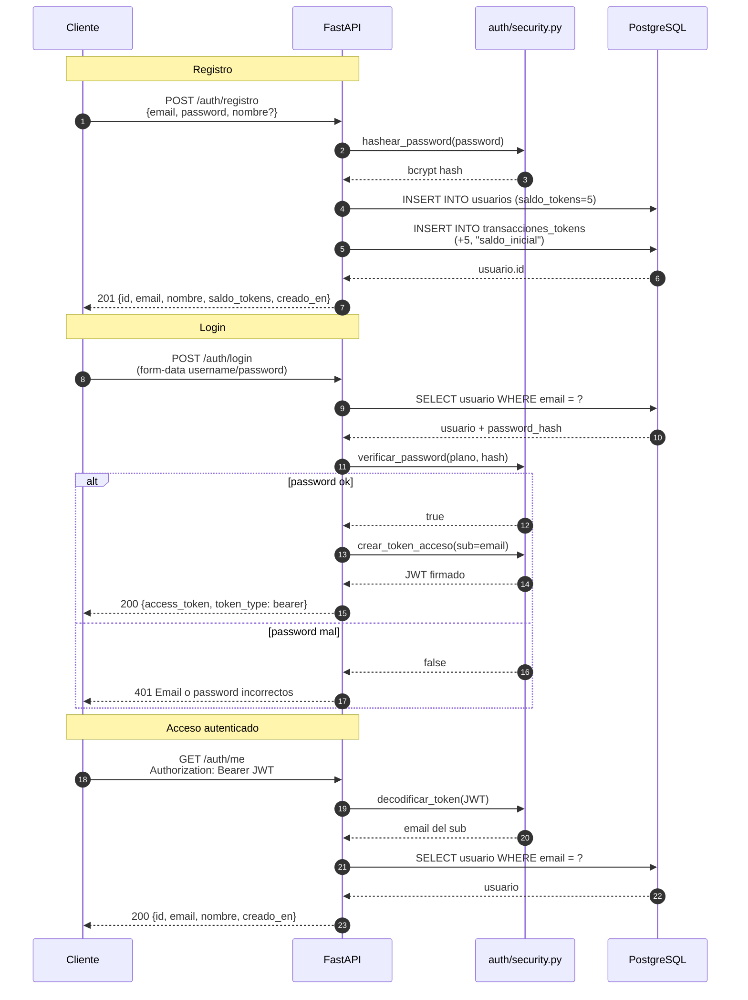
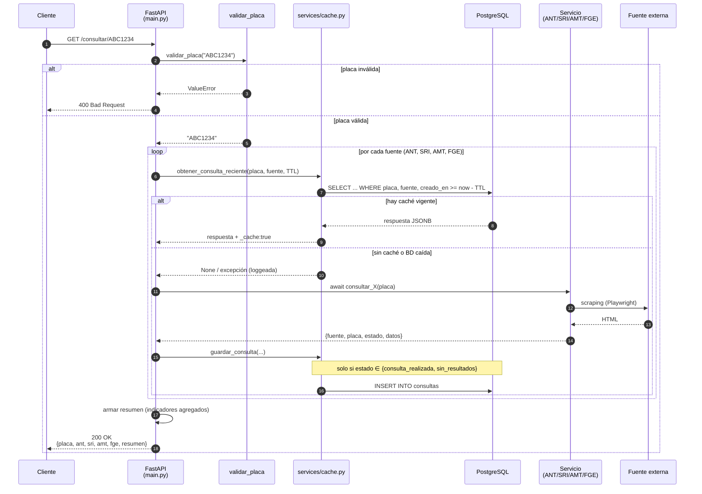
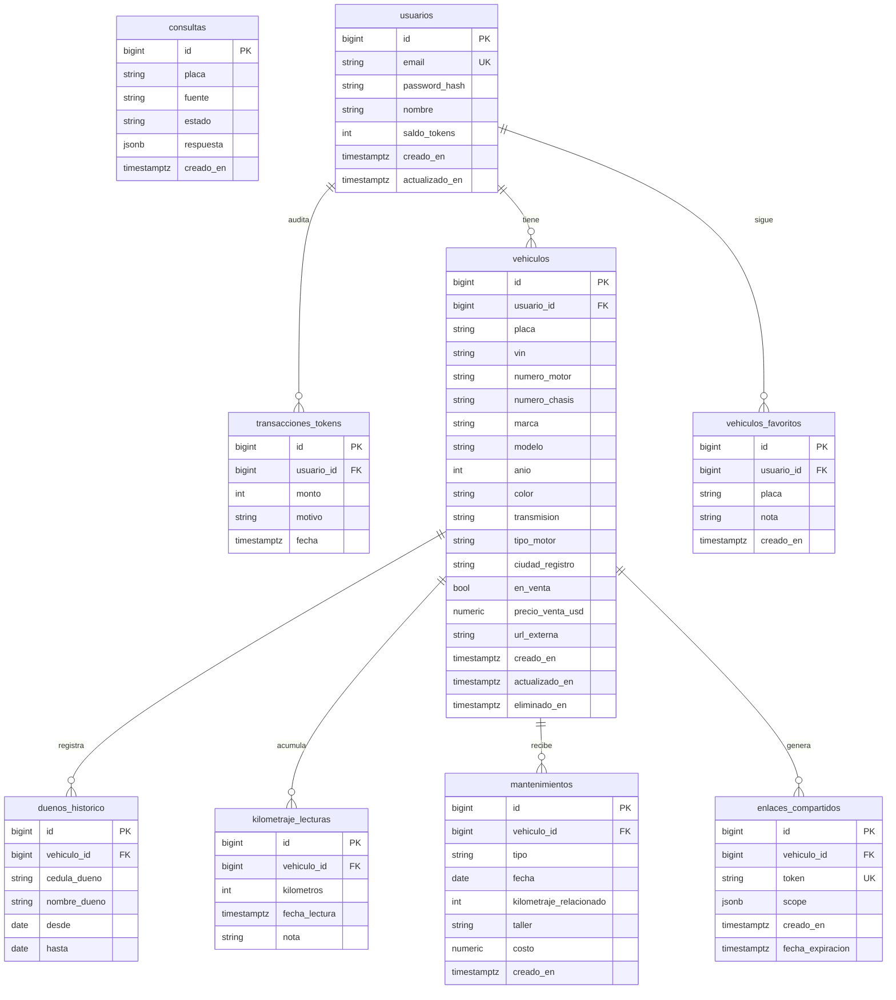

# Arquitectura — `consulta_placas_ec`

Diagramas Mermaid que reflejan el estado actual del sistema. Se actualizan a medida que avanzan los bloques. Renderizan en VSCode (preview de markdown), GitHub y GitLab sin tooling extra.

> **Convención**: lo que existe hoy va en color sólido; lo planeado va punteado con leyenda de fase.

---

## 1. Topología del sistema

Vista de alto nivel: actores, componentes y fuentes externas.

```mermaid
graph TD
    Usuario[Usuario]
    Web[Next.js<br/><i>Vercel free</i>]:::wip

    API[FastAPI<br/>main.py + routers/<br/><i>Render free</i>]
    Cache[(PostgreSQL<br/>Neon)]
    ANT[Servicio ANT<br/>services/ant.py]
    SRI[Servicio SRI<br/>services/sri.py<br/><i>bloqueado_captcha</i>]:::limitado
    AMT[Servicio AMT<br/>services/amt.py]
    FGE[Servicio Fiscalía<br/>services/fiscalia.py]

    ANTWeb[(consultaweb.ant.gob.ec)]
    SRIWeb[(srienlinea.sri.gob.ec)]
    AMTWeb[(servicios.axiscloud.ec<br/>portal AXIS - AMT)]
    FGEWeb[(gestiondefiscalias.gob.ec<br/>SIAF Noticias del Delito)]

    Usuario --> Web
    Usuario -->|/consultar/&#123;placa&#125; · ANT+SRI+AMT+FGE| API
    Usuario -->|/consultar-judicial/&#123;cedula&#125; · FGE| API
    Usuario -->|/auth/* · /vehiculos/* · duenos · kilometraje<br/>mantenimientos · /tokens · /favoritos · /compartir| API
    Usuario -->|/marketplace · /compartido/&#123;token&#125; · público| API
    Web -.->|fetch + JWT Bearer<br/>CORS| API

    API --> Cache
    API --> ANT
    API --> SRI
    API --> AMT
    API --> FGE

    ANT -->|Playwright| ANTWeb
    SRI -->|Playwright| SRIWeb
    AMT -->|Playwright| AMTWeb
    FGE -->|Playwright| FGEWeb

    classDef futuro stroke-dasharray: 5 5, stroke:#888;
    classDef wip stroke-dasharray: 5 5, stroke:#d97706, color:#d97706;
    classDef limitado stroke:#dc2626, color:#dc2626;
```

---

## 2a. Flujo de autenticación (Fase 2)

---

## 2b. Flujo del endpoint `GET /consultar/{placa}`

Secuencia con el caché ya integrado.

---

## 3. Modelo de datos

Entidades existentes (Fases 1-2) y entidades planeadas (Fases 3-4).

**Estado**:
- `consultas` → existe (migración `0001`).
- `usuarios`, `vehiculos`, `duenos_historico`, `kilometraje_lecturas` → existen (migración `0002`, Fase 2 — Bloque 1).
- `vehiculos.numero_motor` y `vehiculos.numero_chasis` → agregados en migración `0003` con soporte de ofuscación (ver [utils/ofuscacion.py](../utils/ofuscacion.py)).
- `vehiculos.transmision/tipo_motor/ciudad_registro`, `usuarios.saldo_tokens` y `transacciones_tokens` → agregados en migración `0004` (Fase 3 — perfil + billetera).
- `vehiculos_favoritos` → migración `0005`; placa como `String` (no FK), única por usuario+placa.
- `mantenimientos` → migración `0006`; `fecha` y `kilometraje_relacionado` monotónicos.
- `vehiculos.en_venta/precio_venta_usd/url_externa` → migración `0007` (Fase 4 — Marketplace). Un auto se lista en `GET /marketplace` solo si `en_venta` y `precio_venta_usd > 0`.
- `enlaces_compartidos` → migración `0008` (Fase 4 — token de compra-venta). `token` único (UK), TTL ≤ 7 días vía `fecha_expiracion`, `scope` JSONB opt-in. `GET /compartido/{token}` devuelve `VehiculoSalidaCompartida` (ofuscado).
- El campo `vehiculos_favoritos.placa` no es FK a propósito (se puede seguir una placa inexistente).

---

## 4. Roadmap visual por bloques

```mermaid
flowchart LR
    subgraph F1["Fase 1 — Consultas estables + caché"]
        B1[Bloque 1<br/>Persistencia base<br/><b>✅</b>]
        B2[Bloque 2<br/>Integrar caché<br/><b>✅</b>]
        B3[Bloque 3<br/>AMT real<br/><b>✅</b>]
        B4[Bloque 4<br/>Fiscalía FGE<br/><b>✅</b>]
        B5[Bloque 5<br/>SRI<br/>bloqueado_captcha<br/>📌 limitación]
    end

    subgraph F2["Fase 2 — Auth + vehículos + deploy"]
        F2A[Bloque 1<br/>Modelos<br/><b>✅</b>]
        F2B[Bloque 2<br/>Auth JWT<br/><b>✅</b>]
        F2C[Bloque 3<br/>CRUD vehículos<br/>+ deploy Render<br/><b>✅</b>]
        F2D[Bloque 4<br/>Dueños + kilometraje<br/><b>✅</b>]
    end

    subgraph F3["Fase 3 — Billetera + Favoritos + Mantenimientos"]
        F3A[Billetera de tokens<br/>+ auditoría<br/><b>✅</b>]
        F3B[Favoritos<br/>por placa<br/><b>✅</b>]
        F3C[Mantenimientos<br/>monotónicos<br/><b>✅</b>]
    end

    subgraph F4["Fase 4 — Compra-venta"]
        F4A[enlaces_compartidos<br/>token privado<br/><b>✅</b>]
        F4B[Marketplace público<br/>en_venta + precio<br/><b>✅</b>]
    end

    subgraph F5["Fase 5"]
        F5A[OCR de placa<br/>desde foto]
    end

    subgraph F6["Fase 6"]
        F6A[App móvil + web]
    end

    B1 --> B2 --> B3 --> B4 --> B5 --> F2A --> F2B --> F2C --> F2D --> F3A --> F3B --> F3C --> F4A --> F4B --> F5A --> F6A

    classDef done fill:#dcfce7,stroke:#16a34a;
    classDef wip fill:#fef9c3,stroke:#ca8a04;
    classDef limitado fill:#fee2e2,stroke:#dc2626;
    class B1,B2,B3,B4,F2A,F2B,F2C,F2D,F3A,F3B,F3C,F4A,F4B done
    class B5 limitado
```

---

## Cómo actualizar este archivo

- Cada vez que cerremos un bloque, marco el nodo correspondiente como ✅ en el roadmap.
- Cuando se agregue una fuente, sumarla a la topología (1) y a la secuencia (2).
- Cuando se cree una entidad nueva, sumarla al ER (3).
- Si un diagrama crece mucho, dividirlo en sub-vistas en archivos `docs/arquitectura/<tema>.md`.
