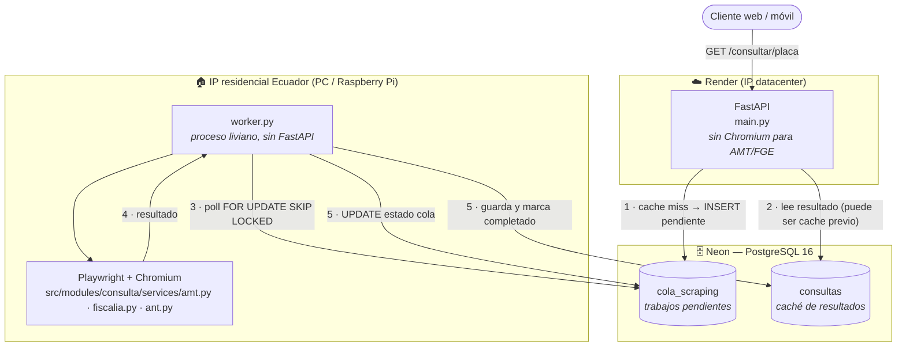

# Arquitectura Híbrida — Worker de scraping con IP residencial

> Diseño de topología. Define **cómo** se desacopla el scraping (frágil y dependiente de IP)
> de la API principal, sin cambiar los servicios `services/<fuente>.py` existentes.
> Decisión base: 2026-05-28 (ver [AGENTS.md](../AGENTS.md) §8, limitación 2).

---

## 1. Problema

Desde Render (IP de datacenter US) **AMT y FGE** detectan el origen cloud y sirven páginas
distintas o desafíos anti-bot. ANT funciona desde cualquier IP; SRI está bloqueado por
reCAPTCHA invisible en local **y** cloud (no lo resuelve el worker).

| Fuente | IP residencial (local) | IP datacenter (Render) | ¿Necesita worker? |
|---|---|---|---|
| ANT | ✅ | ✅ | No — sigue síncrona en la API |
| SRI | 📌 reCAPTCHA | 📌 reCAPTCHA | No — el worker no cambia esto |
| AMT | ✅ | ❌ challenge | **Sí** |
| FGE | ✅ | ❌ challenge | **Sí** |

No es un bug de código: el mismo código responde distinto según la IP de origen.

## 2. Objetivo

Que un **worker ligero** corriendo en una máquina con **IP residencial ecuatoriana**
(PC del dueño, mini-PC o Raspberry Pi) ejecute el scraping de AMT/FGE y empuje los
resultados a la **caché en Neon** (tabla `consultas`). La API principal en Render deja
de instanciar Chromium para esas fuentes y **lee siempre de la BD**.

Decisiones tomadas:

- **Mecanismo de comunicación: tabla de cola en Postgres (Neon).** Cero infra nueva,
  cero costo, mínimo recurso. Se descartó Redis/RabbitMQ por superficie operativa y costo.
- El worker **reutiliza tal cual** `src/modules/consulta/services/ant.py`, `src/modules/consulta/services/amt.py`, `src/modules/consulta/services/fiscalia.py`.
  No se duplica lógica de scraping.

## 3. Topología



Puntos clave de la topología:

- La API y el worker **solo se comunican a través de Neon**. No hay puerto abierto en la
  casa del dueño, no hay webhook entrante: el worker es **pull**, nunca recibe conexiones.
  Esto evita exponer la IP residencial y simplifica el firewall (solo salida a Neon:5432).
- ANT puede seguir corriéndose síncrono en la API (funciona desde datacenter) **o**
  delegarse al worker para uniformar. El diseño soporta ambas; recomendado mantener ANT
  síncrono para no añadir latencia donde no hace falta.
- Pueden correr **N workers** en paralelo (varias casas/dispositivos). `FOR UPDATE SKIP
  LOCKED` garantiza que cada trabajo lo toma un solo worker.

## 4. Tabla de cola (`cola_scraping`)

Migración Alembic manual sugerida: `0009_cola_scraping.py` (ver convención en
[AGENTS.md](../AGENTS.md) §10.2 — migraciones manuales, nombre descriptivo, español).

| Columna | Tipo | Notas |
|---|---|---|
| `id` | `BigInteger` PK | autoincrement |
| `identificador` | `String(20)` | placa o cédula (FGE) ya normalizada |
| `fuente` | `String(10)` | `ANT` · `AMT` · `FGE` |
| `estado` | `String(20)` | `pendiente` · `en_proceso` · `completado` · `error_fuente` (fuente caída tras agotar reintentos) |
| `intentos` | `Integer` | default `0`, se incrementa en cada toma |
| `max_intentos` | `Integer` | default `4` (`MAX_INTENTOS_DEFAULT`) |
| `error` | `Text` nullable | `repr` del último fallo (diagnóstico) |
| `disponible_en` | `DateTime(tz)` | momento a partir del cual es elegible (backoff) |
| `tomado_en` | `DateTime(tz)` nullable | cuándo lo tomó un worker (para detectar zombis) |
| `creado_en` | `DateTime(tz)` | `server_default=now()` |
| `actualizado_en` | `DateTime(tz)` | se refresca en cada `UPDATE` |

Índices:

- `ix_cola_pendientes (estado, disponible_en)` — el worker filtra por aquí.
- `uq_cola_activa (identificador, fuente)` **único parcial** sobre
  `WHERE estado IN ('pendiente','en_proceso')` — **idempotencia**: evita encolar dos veces
  la misma placa+fuente mientras hay un trabajo vivo. La API hace `INSERT ... ON CONFLICT
  DO NOTHING`.

> El resultado del scraping **no** vive en `cola_scraping`: se guarda en `consultas` con el
> contrato de caché existente ([src/modules/consulta/services/cache.py](../src/modules/consulta/services/cache.py)). La cola solo
> coordina el trabajo. Así la API no cambia su forma de leer resultados.

## 5. Flujo de una consulta

```mermaid
sequenceDiagram
    participant C as Cliente
    participant A as API (Render)
    participant Q as cola_scraping (Neon)
    participant K as consultas (Neon)
    participant W as worker.py (casa)

    C->>A: GET /consultar/ABC1234
    A->>K: ¿hay caché vigente AMT/FGE?
    alt caché vigente
        K-->>A: resultado
        A-->>C: 200 (estado: consulta_realizada, _cache: true)
    else cache miss
        A->>Q: INSERT (AMT, FGE) ON CONFLICT DO NOTHING
        A-->>C: 200 (estado: en_proceso para AMT/FGE)
        Note over C: el frontend reintenta /consultar en unos segundos
    end

    loop polling del worker (cada N s)
        W->>Q: SELECT ... FOR UPDATE SKIP LOCKED LIMIT 1
        Q-->>W: trabajo (AMT, ABC1234)
        W->>W: ejecuta src/modules/consulta/services/amt.py (Playwright)
        alt éxito
            W->>K: guarda en consultas (consulta_realizada / sin_resultados)
            W->>Q: UPDATE estado='completado'
        else fallo
            W->>Q: intentos+1; si < max → 'pendiente' con backoff; si no → 'error_fuente'
        end
    end
```

### Estados de respuesta del worker: `en_proceso` y `error_fuente`

La API necesita comunicar "lo encolé, todavía no hay dato" y "la fuente está caída". Se
añaden al contrato estándar ([respuesta-api-estandar](../.claude/skills/respuesta-api-estandar/SKILL.md) §estado):

| Estado | Cuándo |
|---|---|
| `en_proceso` | La consulta se encoló para el worker; aún no hay resultado. `datos: null`. No se cachea. |
| `error_fuente` | El worker agotó `max_intentos` (4): la fuente oficial está caída/bloqueando. `datos: null` + `error`. La API lo devuelve durante una ventana de enfriamiento (12h) sin re-encolar; el cliente deja de pollear y puede llamar a `POST /consultar/{identificador}/reintentar/{fuente}`. |

El endpoint sigue devolviendo **200** siempre (una fuente encolada no es un error). El
`resumen` marca `amt_consultado: false` / `fge_consultado: false` hasta que llegue el dato.
El frontend hace *polling* corto a `/consultar/{placa}` (o un futuro endpoint de estado)
hasta ver `consulta_realizada`.

> **Compatibilidad:** este es el único cambio de contrato. El frontend
> ([consulta-placas-web](https://github.com/VMarcosGC/consulta-placas-web)) debe tratar
> `en_proceso` como "cargando" para AMT/FGE. ANT/SRI no cambian.

## 6. Resiliencia (requisito de la tarea)

- **Reintentos automáticos con backoff exponencial.** En cada fallo: `intentos += 1` y se
  reprograma con `disponible_en = now() + base * 2^intentos` (p. ej. 30s, 60s, 120s).
  Al agotar `max_intentos` (4) → `estado='error_fuente'` con el `error` guardado: no vuelve a
  la cola (corta el bucle infinito ante una fuente caída) y la API lo expone al cliente.
- **`FOR UPDATE SKIP LOCKED`**: dos workers nunca toman el mismo trabajo; si uno está
  ocupado, el otro salta a la siguiente fila. Concurrencia segura sin broker.
- **Recuperación de zombis**: un trabajo `en_proceso` con `tomado_en` más viejo que un
  timeout (p. ej. 5 min, por si el worker se cayó a mitad) se considera huérfano y vuelve a
  `pendiente`. Una query de "rescate" corre al inicio de cada ciclo de polling.
- **Idempotencia**: el índice único parcial impide duplicados; reprocesar un trabajo solo
  reescribe la caché (operación naturalmente idempotente).
- **Tolerancia a fallos de fuente**: los `services/<fuente>.py` ya capturan todo y devuelven
  `{estado: error}` sin propagar excepciones (AGENTS.md §5). El worker trata ese `error`
  como fallo reintentable; un portal caído no tumba el worker.
- **Apagado limpio**: el worker atrapa `SIGTERM`/`KeyboardInterrupt`, termina el trabajo en
  curso (o lo devuelve a `pendiente`) y cierra el navegador antes de salir.
- **Caché y reintento coherentes**: solo `consulta_realizada`/`sin_resultados` se guardan en
  `consultas` (regla existente de [cache.py](../src/modules/consulta/services/cache.py)); `error` no se cachea,
  así un reintento posterior puede tener éxito.

## 7. Uso mínimo de recursos (requisito de la tarea)

- **Proceso único sin FastAPI**: `worker.py` es un loop `asyncio`, no levanta servidor HTTP.
- **Un solo navegador reutilizado**: lanza Chromium **una vez** al arrancar y reusa el
  `browser`/`context` entre trabajos (abre/cierra solo `page`). Evita el costo de cold start
  de Chromium por consulta.
- **Polling con respaldo**: intervalo configurable (`WORKER_POLL_SEGUNDOS`, default 5s).
  Cuando la cola está vacía, duerme el intervalo completo; con carga, procesa back-to-back.
  Opcional: `LISTEN/NOTIFY` de Postgres para despertar al instante en vez de polling fijo
  (la API hace `NOTIFY cola_scraping` tras encolar). Polling es el default por simplicidad.
- **Serial por diseño**: el worker procesa **un trabajo a la vez** contra la misma fuente
  (regla AGENTS.md §15 — no paralelizar contra la misma fuente). Esto también acota RAM/CPU,
  ideal para una Raspberry Pi.
- **Sin estado local**: toda la coordinación vive en Neon; el worker es desechable y se
  puede reiniciar sin pérdida.

## 8. Despliegue del worker

- **Mismo repo**, nuevo entrypoint `worker.py` en la raíz (junto a `run.py`). Reusa
  `src/core/database.py`, `services/` y `models/`. Comparte `requirements.txt` (ya trae Playwright).
- **Variables de entorno** (mismas que la API, solo BD + ajustes del loop):
  - `DATABASE_URL` — apunta al **mismo** Neon que usa Render.
  - `WORKER_POLL_SEGUNDOS` (default `5`), `WORKER_MAX_INTENTOS` (default `3`),
    `WORKER_BACKOFF_BASE_SEGUNDOS` (default `30`), `WORKER_TIMEOUT_ZOMBI_SEGUNDOS` (default `300`).
- **Arranque persistente**:
  - Linux/Raspberry Pi: unidad `systemd` con `Restart=always`.
  - Windows: Programador de tareas o NSSM como servicio.
- **IP residencial**: el dispositivo debe estar en una conexión doméstica ecuatoriana
  (la misma que hoy funciona en local). Si la IP cambia (dinámica), no importa: el worker es
  *outbound-only* hacia Neon.
- **Windows + Playwright**: aplicar `WindowsProactorEventLoopPolicy` al inicio de `worker.py`
  igual que [run.py](../run.py) (evita `NotImplementedError`).

## 9. Cambios en la API (resumen)

1. Modelo nuevo `src/modules/consulta/models/cola_scraping.py` + migración `0009_cola_scraping.py`.
2. En `consultar_con_cache` (o un helper nuevo): para AMT/FGE, si hay cache miss →
   `INSERT ... ON CONFLICT DO NOTHING` en `cola_scraping` y devolver `{estado: "en_proceso"}`
   en vez de invocar Playwright. **La API en Render deja de importar/instanciar Chromium para
   esas fuentes.** (ANT puede seguir directo.)
3. Añadir `en_proceso` como estado válido del contrato (no cacheable).
4. Sin cambios en `services/<fuente>.py`.

## 10. Qué NO hace este diseño

- **No resuelve SRI**: el reCAPTCHA invisible bloquea igual desde IP residencial. SRI sigue
  `bloqueado_captcha` (AGENTS.md §8, limitación 1).
- **No mezcla CRUD con scraping**: Billetera/Favoritos/Mantenimientos/Marketplace siguen
  tocando solo la BD (AGENTS.md §10.2). La cola es exclusiva del pipeline de scraping.
- **No introduce un broker externo**: la coordinación es 100% Postgres.

---

## Checklist de implementación (fase futura)

- [ ] `src/modules/consulta/models/cola_scraping.py` + migración `0009_cola_scraping.py` (índice único parcial).
- [ ] `worker.py` (loop asyncio, navegador reutilizado, backoff, rescate de zombis, apagado limpio).
- [ ] Helper de encolado en la API + estado `en_proceso` en el contrato.
- [ ] La API en Render deja de instanciar Chromium para AMT/FGE.
- [ ] Frontend: tratar `en_proceso` como "cargando" + polling.
- [ ] systemd/Programador de tareas en la máquina residencial.
- [ ] Actualizar diagramas en [docs/arquitectura.md](arquitectura.md) y skill
      [scraping-respetuoso](../.claude/skills/scraping-respetuoso/SKILL.md).
